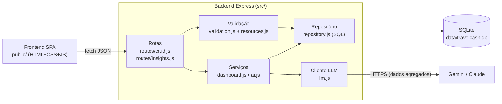

# TravelCash — Controle Financeiro para Viagens ✈️💰

> Projeto acadêmico FIAP • **Checkpoint 2** — Aplicação, Dashboard, Otimização e Inteligência Artificial

Aplicação full-stack para planejar e acompanhar os gastos de uma viagem: orçamento, despesas por
categoria, roteiro, metas de economia e alertas — com **dashboard em tempo real** e **IA (LLM)**
que classifica despesas automaticamente e gera uma análise financeira da viagem.

| | |
|---|---|
| **Swagger** | `http://localhost:3000/api/docs` |
| **Aplicação** | `http://localhost:3000` |
| **Trello / Notion** | _adicione o link do quadro do grupo aqui_ |

---

## Sumário

1. [Problema e solução](#problema-e-solução)
2. [Integrantes](#integrantes)
3. [Tecnologias](#tecnologias)
4. [Instalação e execução](#instalação-e-execução)
5. [Variáveis de ambiente](#variáveis-de-ambiente)
6. [Arquitetura](#arquitetura)
7. [Funcionalidades](#funcionalidades)
8. [Banco de dados](#banco-de-dados)
9. [Endpoints](#endpoints)
10. [Otimizações da API (CP2)](#otimizações-da-api-cp2)
11. [Integração com LLM](#integração-com-llm)
12. [Testes](#testes)
13. [Evolução CP1 → CP2](#evolução-cp1--cp2)

---

## Problema e solução

**Problema:** em viagens, os gastos ficam espalhados (cartão, dinheiro, câmbio, apps) e o viajante só
percebe que estourou o orçamento quando já é tarde. Planilhas não alertam nem explicam para onde o
dinheiro está indo.

**Solução:** o TravelCash centraliza orçamento e despesas por viagem, mostra em um dashboard quanto
já foi consumido, a média diária e a projeção de custo final, **dispara alertas automáticos** (80% do
orçamento, média diária acima do limite, projeção de estouro, concentração em uma categoria) e usa
uma **LLM** para categorizar despesas e recomendar ações.

## Tecnologias

| Camada | Tecnologia |
|---|---|
| Backend | Node.js 20+ • Express 4 |
| Banco | SQLite (`better-sqlite3`) — relacional, sem servidor externo |
| Segurança | `helmet` (cabeçalhos HTTP/CSP) • `express-rate-limit` • validação própria • escape de HTML no frontend |
| Documentação | OpenAPI 3 + `swagger-ui-express` (gerado a partir do código) |
| IA | Google Gemini (`gemini-2.5-flash`) **ou** Anthropic Claude (`claude-haiku-4-5`) via REST — com fallback por regras |
| Frontend | HTML + CSS + JavaScript puro (SPA, sem framework), gráficos em SVG |
| Testes | `node:test` (nativo) + `supertest` |

## Instalação e execução

Pré-requisito: **Node.js 20, 22 ou 24 (LTS)** (`node -v`).

```bash
git clone https://github.com/gustafpsdev/App---Controle-financeiro.git
cd App---Controle-financeiro
npm install
cp .env.example .env      # opcional — só necessário para ativar a LLM
npm start
```

Abra `http://localhost:3000` (aplicação) e `http://localhost:3000/api/docs` (Swagger).

Na primeira execução o banco `data/travelcash.db` é criado e populado com dados de exemplo.

| Script | O que faz |
|---|---|
| `npm start` | Sobe o servidor |
| `npm run dev` | Sobe com reload automático |
| `npm test` | Executa os 44 testes automatizados |
| `npm run test:coverage` | Testes + relatório de cobertura |
| `npm run docs:generate` | Regenera `docs/openapi.yaml` a partir das validações |
| `npm run db:reset` | Apaga o banco (recriado com os dados de exemplo no próximo start) |

## Variáveis de ambiente

Todas são opcionais (veja `.env.example`).

| Variável | Padrão | Descrição |
|---|---|---|
| `PORT` | `3000` | Porta HTTP |
| `DB_FILE` | `data/travelcash.db` | Caminho do banco SQLite (`:memory:` = temporário) |
| `SEED_DB` | `true` | Popular o banco com `data/seed.json` quando vazio |
| `CORS_ORIGIN` | `*` | Origem permitida no CORS |
| `LLM_PROVIDER` | automático | `gemini`, `anthropic` ou `none` |
| `GEMINI_API_KEY` | — | Chave do Google AI Studio (gratuita) |
| `ANTHROPIC_API_KEY` | — | Chave da Anthropic |
| `LLM_MODEL` | por provedor | Sobrescreve o modelo |
| `LLM_TIMEOUT_MS` | `15000` | Tempo limite da chamada à LLM |
| `LLM_CACHE_TTL_MS` | `600000` | Cache das análises (10 min) |
| `AI_RATE_LIMIT_PER_MIN` | `20` | Limite de chamadas de IA por IP/minuto |
| `API_RATE_LIMIT_PER_MIN` | `300` | Limite geral da API por IP/minuto |

> Sem chave de LLM a aplicação funciona normalmente: a classificação e a análise usam regras locais e
> a interface indica **"Regras locais (sem LLM)"**.

## Arquitetura



```text
├── server.js                 # inicialização (porta, logs)
├── src/
│   ├── app.js                # Express: segurança, rotas, Swagger, tratamento de erros
│   ├── config.js             # variáveis de ambiente centralizadas
│   ├── resources.js          # definição declarativa dos recursos (campos, tipos, filtros, regras)
│   ├── validation.js         # validação/normalização gerada a partir de resources.js
│   ├── repository.js         # SQL genérico: listagem paginada, filtros, FK, unicidade
│   ├── errors.js             # AppError + formato padrão de resposta
│   ├── db/
│   │   ├── schema.sql        # tabelas, FKs, CHECKs e índices
│   │   └── index.js          # conexão, criação do schema e seed
│   ├── routes/
│   │   ├── crud.js           # REST genérico para cada recurso
│   │   └── insights.js       # dashboard, overview e IA
│   └── services/
│       ├── dashboard.js      # agregações SQL + alertas automáticos
│       ├── llm.js            # cliente Gemini/Claude (fetch, timeout, parse JSON)
│       └── ai.js             # regras de negócio com IA + fallback
├── public/                   # frontend
├── docs/
│   ├── openapi.yaml          # Swagger (gerado)
│   ├── MODELAGEM.md          # decisões de normalização + diagrama ER
│   └── APRESENTACAO-CP2.md   # roteiro da apresentação e cartões do Trello
├── scripts/generate-openapi.js
├── tests/                    # testes unitários e de integração
└── data/seed.json            # dados de exemplo (migrados do db.json do CP1)
```

**Decisão central:** cada recurso é descrito uma única vez em `src/resources.js` (campos, tipos,
obrigatoriedade, limites, FKs, filtros, ordenações e regras). A partir dessa definição são gerados a
validação, o SQL do repositório e o Swagger — o que elimina duplicação e mantém documentação e código
sempre coerentes.

## Funcionalidades

**Frontend (SPA)**
- **Dashboard** com seletor de viagem: orçamento, gasto, saldo, % utilizado, média diária x limite,
  orçamento diário restante, maior categoria, score financeiro, gráfico de categorias, gráfico de
  **evolução (acumulado ou por dia) com linha do orçamento**, alertas automáticos e manuais, roteiro,
  metas e últimas despesas — **tudo vindo da API**.
- **Análise inteligente (IA)** no dashboard, exibindo os dados enviados ao modelo.
- **Despesas** com busca, filtros, ordenação e **paginação no servidor**, criação, **edição** e exclusão;
  botão **✨ Sugerir categoria** e opção **Automática (IA)** no cadastro.
- Viagens, Orçamentos, Roteiro, Metas (com contribuição), Relatórios (CSV/impressão), Alertas e Configurações.
- Feedback visual: toasts de sucesso/erro com a mensagem da API, campos com erro destacados, estados
  vazios e carregamento.

**Backend**
- CRUD completo para 10 recursos com `GET/POST/PUT/PATCH/DELETE`.
- Validação de tipos, formatos (data, e-mail, cor), limites, enums e chaves estrangeiras.
- Regras de negócio: término ≥ início da viagem; 1 orçamento por viagem; valores positivos;
  categoria em uso não pode ser apagada; classificação automática de despesas; alertas automáticos.
- Respostas padronizadas e códigos HTTP corretos (`200, 201, 400, 404, 409, 413, 422, 429, 500`).

## Banco de dados

SQLite com 10 tabelas, chaves estrangeiras, `CHECK`s e índices. Decisões de normalização e diagrama ER
em **[docs/MODELAGEM.md](docs/MODELAGEM.md)**. Resumo das mudanças em relação ao CP1:

- Categoria virou tabela (`categories`) referenciada por FK — fim do texto repetido.
- `goals.progress` deixou de ser armazenado (atributo derivado → calculado).
- `UNIQUE` em `budgets.trip_id`, `users.email`, `categories.name`.
- `ON DELETE CASCADE` para dados da viagem; `RESTRICT` para categoria em uso.
- Índices em `(trip_id, date)` e demais colunas de filtro/JOIN.

## Endpoints

Documentação interativa completa em **`/api/docs`** (OpenAPI em `/api/openapi.json`).

### Padrão de resposta

```json
// sucesso (listagens incluem meta)
{ "success": true, "data": [ ... ], "meta": { "page": 1, "limit": 20, "total": 10, "totalPages": 1, "sort": "-date" } }

// erro
{ "success": false, "error": { "code": "VALIDATION_ERROR", "message": "Dados inválidos na requisição.",
  "details": [ { "field": "amount", "message": "Deve ser maior ou igual a 0.01." } ] } }
```

### CRUD

Recursos: `users`, `trips`, `budgets`, `categories`, `expenses`, `itinerary`, `transports`, `insurances`, `goals`, `alerts`.

| Método | Rota | Descrição |
|---|---|---|
| GET | `/api/{recurso}` | Lista paginada — `page`, `limit` (máx. 100), `sort` (`-campo` = desc), `search`, `tripId` e filtros do recurso |
| GET | `/api/{recurso}/{id}` | Busca por id |
| POST | `/api/{recurso}` | Cria (201) |
| PUT / PATCH | `/api/{recurso}/{id}` | Atualiza somente os campos enviados |
| DELETE | `/api/{recurso}/{id}` | Remove |

Filtros extras: despesas → `category`, `categoryId`, `dateFrom`, `dateTo`, `minAmount`, `maxAmount`;
viagens → `status`; alertas → `type`; roteiro → `dateFrom`, `dateTo`.

```http
GET /api/expenses?tripId=1&category=Alimentação&dateFrom=2025-05-20&sort=-amount&page=1&limit=10
```

### Dashboard e IA

| Método | Rota | Descrição |
|---|---|---|
| GET | `/api/health` | Status da API e do banco |
| GET | `/api/dashboard?tripId=1` • `/api/trips/{id}/dashboard` | Indicadores, categorias, evolução diária, projeção, alertas automáticos |
| GET | `/api/overview` | Resumo de todas as viagens em uma consulta |
| GET | `/api/ai/status` | Provedor/modelo de LLM ativo |
| POST | `/api/ai/classify-expense` | Sugere categoria de uma despesa |
| GET | `/api/trips/{id}/insights` (`?refresh=true`) | Análise financeira da viagem gerada pela LLM |

## Otimizações da API (CP2)

| # | Antes (CP1) | Depois (CP2) | Ganho |
|---|---|---|---|
| 1 | Cada `store.list()` **relia o arquivo JSON inteiro** do disco; o dashboard fazia isso 8 vezes por requisição | Banco SQLite com conexão única e *prepared statements* | Menos I/O e parsing por requisição |
| 2 | Totais e gastos por categoria **somados em JavaScript** após carregar todas as despesas | `SUM`, `COUNT`, `MAX` e `GROUP BY` no SQL | Só os números trafegam do banco para a API |
| 3 | Listagens retornavam **todos** os registros | Paginação (`page`, `limit` máx. 100) + `meta.total` | Respostas menores e previsíveis |
| 4 | Filtro só por `tripId`; demais filtros e busca feitos no navegador | Filtros, busca (`LIKE`) e ordenação no servidor, com índices | Frontend baixa só o que exibe |
| 5 | Relatório "por viagem" exigia carregar despesas e orçamentos de todas as viagens | `GET /api/overview` com subconsultas agregadas | 1 requisição em vez de várias |
| 6 | Busca do frontend disparava requisição a cada tecla | *Debounce* de 300 ms | Menos requisições desnecessárias |
| 7 | Análise da IA seria recalculada a cada clique | Cache por *hash* dos dados (10 min) | Menos custo e latência com a LLM |
| 8 | Validação só de "campo vazio" | Tipos, formatos, limites, FKs e regras | Erros claros (`details` por campo) |
| 9 | Erros sem padrão para JSON inválido, FK, duplicidade | Middleware central com `400/404/409/413/422/429` | Frontend mostra a mensagem exata |

## Integração com LLM

| Item | Detalhe |
|---|---|
| **Modelo/serviço** | Google **Gemini 2.5 Flash** (padrão — camada gratuita) ou **Claude Haiku 4.5**, chamados via API REST (`src/services/llm.js`), sem SDK. |
| **Finalidade 1 — Classificação** | Classifica despesas pela descrição em uma das categorias cadastradas. Usada no botão **✨ Sugerir**, na opção **Automática (IA)** e em todo `POST /api/expenses` sem categoria. |
| **Finalidade 2 — Análise financeira** | Gera resumo, nível de saúde (boa/atenção/crítica), pontos de atenção, recomendações e previsão para a viagem. |
| **Dados enviados** | Classificação: descrição (≤ 200 caracteres) e valor. Análise: **apenas números agregados** — destino, duração, nº de viajantes, orçamento, gasto, média, projeção, totais por categoria, 5 maiores despesas e títulos dos alertas. **Nunca** nome, e-mail ou IDs do usuário. O painel da IA mostra exatamente o JSON enviado. |
| **Resposta obtida** | JSON estruturado (`{category, confidence, reason}` / `{resumo, saude, pontosDeAtencao, recomendacoes, previsao}`), pedido em modo JSON. |
| **Uso pela aplicação** | A categoria é **gravada** na despesa (FK); a análise é exibida no dashboard. O campo `source` (`llm`/`regras`) indica a origem. |
| **Limitações** | O modelo pode errar a categoria em descrições ambíguas ("Taxas"); depende de internet e de cota do provedor; latência de 1–5 s; a análise não conhece câmbio nem preços locais; respostas podem variar entre execuções. |
| **Segurança e dados sensíveis** | Chaves só no `.env` (fora do Git); sem dados pessoais no prompt; texto do usuário limpo, truncado e delimitado como **dado** (mitiga *prompt injection*); a saída é **validada** (categoria precisa existir; formato conferido) e, se inválida, usa-se o fallback; *timeout* de 15 s; *rate limit* de 20 req/min; HTML escapado no frontend. |
| **Fallback** | Sem chave, com erro, *timeout* ou resposta inválida → regras locais (palavras-chave e limiares). A aplicação nunca para por causa da IA. |

## Testes

```bash
npm test
```

44 testes (unitários + integração) rodando em banco **em memória** e com a LLM **simulada**
(nenhuma chamada externa durante os testes):

- **Validação (unitário):** datas, obrigatórios, conversão de tipos, enums, e-mail, validação parcial, regra de datas.
- **API (integração):** paginação/filtros/ordenação/busca, CRUD, 400/404/409/422, cascata, FK restrita, JSON inválido, cabeçalhos de segurança, Swagger.
- **Dashboard:** totais conferidos contra a soma das despesas, evolução diária, alertas automáticos.
- **IA:** fallback sem chave, classificação via LLM simulada, categoria inventada descartada, falha do provedor, classificação automática no `POST`, proteção contra *prompt injection*, ausência de dados pessoais e cache.

## Evolução CP1 → CP2

| Requisito do CP2 | Onde está |
|---|---|
| Evolução do backend | `src/` (camadas, validação, regras, segurança, respostas padronizadas) |
| Frontend integrado à API | `public/` (CRUD com edição, feedback de erro/sucesso, paginação) |
| Dashboard com dados reais | Aba Dashboard + `GET /api/dashboard` |
| Otimização da API | [seção acima](#otimizações-da-api-cp2) |
| Banco revisado e normalizado | `src/db/schema.sql` + [docs/MODELAGEM.md](docs/MODELAGEM.md) |
| Documentação e Swagger | Este README + `/api/docs` |
| Testes | `tests/` → `npm test` |
| LLM | `src/services/ai.js` e `llm.js` + painel no dashboard |
| Organização ágil | Quadro do grupo (link no topo) — sugestão de cartões em [docs/APRESENTACAO-CP2.md](docs/APRESENTACAO-CP2.md) |
