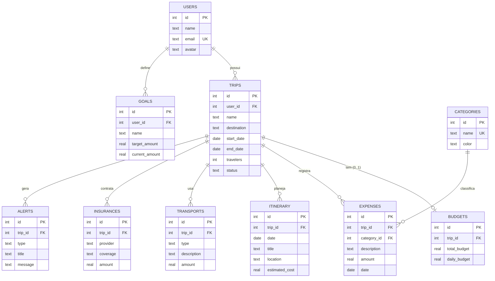

# Modelagem e normalização do banco — CP2

No CP1 os dados ficavam em um único arquivo `data/db.json`. No CP2 o projeto passou a usar
**SQLite** (via `better-sqlite3`), um banco relacional real que roda sem servidor externo — o
grupo não precisa instalar nada além do `npm install`.

O esquema completo está em [`src/db/schema.sql`](../src/db/schema.sql). Na primeira execução,
as tabelas são criadas e populadas com os dados de exemplo do CP1 (`data/seed.json`).

## Diagrama entidade-relacionamento

## Problemas encontrados no modelo do CP1 e como foram resolvidos

| Problema no CP1 (JSON) | Decisão no CP2 | Justificativa |
|---|---|---|
| Categoria da despesa era **texto livre repetido** em cada registro (`"Alimentação"`, `"Alimentacao"`, …) | Tabela `categories` + FK `expenses.category_id` | Elimina duplicidade e erros de digitação (1FN/3FN); permite renomear/colorir a categoria em um só lugar. A API continua aceitando o **nome** da categoria para não quebrar o frontend. |
| `goals.progress` era **armazenado**, mesmo sendo `currentAmount / targetAmount` | Campo removido; calculado no `SELECT` | Atributo derivado gera inconsistência (o CP1 tinha `progress` desatualizado ao contribuir para a meta). 3FN: nenhum atributo depende de outro não-chave. |
| Nada impedia **dois orçamentos para a mesma viagem** | `UNIQUE (budgets.trip_id)` | Regra de negócio: 1 orçamento por viagem. A API devolve **409 Conflict**. |
| Despesas podiam apontar para **viagem inexistente** | `FOREIGN KEY ... ON DELETE CASCADE` | Integridade referencial. Ao excluir uma viagem, despesas/roteiro/alertas dela também saem. |
| Categoria podia ser apagada mesmo em uso | `ON DELETE RESTRICT` em `expenses.category_id` | Evita despesas "órfãs". A API devolve **409**. |
| Valores negativos, datas invertidas e status livres eram aceitos | `CHECK (amount > 0)`, `CHECK (end_date >= start_date)`, `CHECK (status IN (...))`, `CHECK (type IN ('info','warning','danger'))` | Defesa em profundidade: a API valida antes, e o banco garante mesmo que alguém grave direto. |
| E-mail duplicado com maiúsculas diferentes | `email UNIQUE COLLATE NOCASE` + normalização para minúsculas | Evita usuários duplicados. |
| Sem dono das viagens/metas | `user_id` em `trips` e `goals` | Prepara o sistema para múltiplos usuários. |
| Sem histórico de criação/alteração | `created_at` / `updated_at` em todas as tabelas | Auditoria e ordenação por data de cadastro. |
| Alertas "fixos" ficavam desatualizados | Alertas **automáticos** calculados por regras a cada consulta; tabela `alerts` só para alertas manuais | Dado derivado não deve ser persistido (mesma lógica do `progress`). |

## Índices

| Índice | Motivo |
|---|---|
| `idx_expenses_trip_date (trip_id, date)` | Filtro mais usado do sistema (despesas de uma viagem ordenadas por data) e base do gráfico de evolução diária |
| `idx_expenses_category (category_id)` | JOIN com `categories` e agrupamento por categoria no dashboard |
| `idx_itinerary_trip_date (trip_id, date)` | Próximas atividades da viagem |
| `idx_transports_trip`, `idx_insurances_trip`, `idx_alerts_trip` | Filtros por viagem |
| `idx_trips_user`, `idx_goals_user` | Consultas por usuário |
| `UNIQUE` em `users.email`, `budgets.trip_id`, `categories.name` | Criam índice automaticamente e garantem unicidade |

## Por que SQLite?

- Banco relacional de verdade (FK, CHECK, índices, transações, `GROUP BY`) — atende normalização e integridade.
- Zero configuração: o arquivo `data/travelcash.db` é criado sozinho. Facilita a correção e a apresentação.
- Migrar para PostgreSQL/MySQL depois exige mudar apenas `src/db/` e o SQL do repositório; rotas, validação e frontend não mudam.
